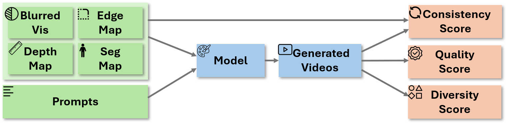

# PAI-Bench -- Transfer

[](https://www.python.org/downloads/release/python-3100/)
[](https://huggingface.co/datasets/shi-labs/physical-ai-bench-transfer)

---

## Table of Contents

- [Dataset](#dataset)
- [Setup](#setup)
- [Usage](#usage)
  - [1. Prepare Your Result Videos](#1-prepare-your-result-videos)
  - [2. Run the Benchmark](#2-run-the-benchmark)
  - [3. Calculate Diversity Score](#3-calculate-diversity-score)
- [Acknowledgments](#acknowledgments)
- [Citation](#citation)

## Dataset

The full benchmark dataset is hosted on the Hugging Face Hub.

- **Hugging Face Link**: [physical-ai-bench-transfer](https://huggingface.co/datasets/shi-labs/physical-ai-bench-transfer)

## Setup

Follow these steps to set up the environment for running the benchmark.

### Environment Setup

```bash
git clone git@github.com:SHI-Labs/physical-ai-bench.git
cd physical-ai-bench/transfer
```

### Install Dependencies

```bash
# Sync dependencies using uv
uv sync

# Install Grounded-SAM-2 from the third_party directory
uv pip install -e third_party/Grounded-SAM-2
uv pip install --no-build-isolation -e third_party/Grounded-SAM-2/grounding_dino
```

### Download Checkpoints

```bash
bash get_checkpoint.sh
```

## Usage

The overall evaluation pipeline is illustrated below:



### 1. Prepare Your Result Videos

Organize the videos generated by your models according to the following directory structure.

**Directory Structure:**

The `/path/to/your/results` directory should contain a `videos` subdirectory with video files:

```text
/path/to/your/results/
└── videos/
    ├── task_0001__0.mp4
    ├── task_0001__1.mp4
    ├── task_0001__2.mp4
    ├── task_0001__3.mp4
    ├── task_0001__4.mp4
    ├── task_0001__5.mp4
    ├── task_0002__0.mp4
    ├── ...
    └── task_0599__5.mp4
```

**File Naming Convention:**

- Each video file follows the pattern: `{video_id}__{caption_id}.mp4`
- The video_id represents the task ID (e.g., task_0001, task_0002, etc.)
- The caption_id represents different caption variations for the same video (0-5)

### 2. Run the Benchmark

Use this command to evaluate depth and segmentation metrics:

```bash
uv run python -m torch.distributed.run --standalone --nproc_per_node 8 compute_metrics.py calculate-metrics \
--gt_path ${path_to_hf_dataset} \
--videos_path ${path_to_your_videos}
```

**Argument Explanations:**

- `--gt_path`: Path to the Ground Truth videos from the downloaded dataset
- `--videos_path`: Path to the directory containing the `videos` subdirectory
- `--output_path`: (Optional) Path where evaluation results will be saved
- `--force_recompute_gt_depth`: (Optional) Force re-computation of depth maps for the Ground Truth videos
- `--force_recompute_gt_seg`: (Optional) Force re-computation of segmentation maps for the Ground Truth videos

### 3. Calculate Diversity Score

Use this command to evaluate the diversity of generated videos:

```bash
uv run python -m torch.distributed.run --standalone --nproc_per_node 8 compute_diversity_score.py calculate-diversity \
--videos_path ${path_to_your_videos}
```

**Argument Explanations:**

- `--videos_path`: Path to the directory containing the `videos` subdirectory
- `--output_path`: (Optional) Path where diversity results will be saved

## Acknowledgments

We would like to express our sincere gratitude to the developers and contributors of:

- [Video-Depth-Anything](https://github.com/DepthAnything/Video-Depth-Anything)
- [Grounded-SAM-2](https://github.com/IDEA-Research/Grounded-SAM-2)

## Citation
