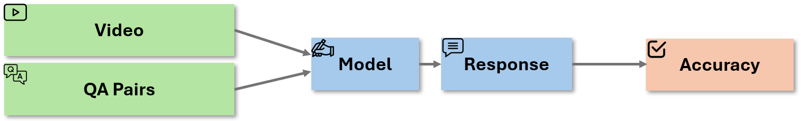

# PAI-Bench-U (Video Understanding)

[](https://www.python.org/downloads/release/python-3100/)
[](https://huggingface.co/datasets/shi-labs/physical-ai-bench-understanding)

---

## Dataset

PAI-Bench Video Understanding evaluates understanding of physical scenes through video reasoning tasks.

## Evaluation

The overall evaluation pipeline is illustrated below:



We use [lmms-eval](https://github.com/Leymore/lmms-eval) (pai-bench branch) for standardized evaluation.

### Setup

Clone the evaluation repository:

```bash
git clone -b pai-bench https://github.com/Leymore/lmms-eval.git
cd lmms-eval
uv pip install -e ".[all]"
```

### Method 1: Using vLLM (Recommended)

First, deploy your model with vLLM (using Qwen/Qwen2.5-VL-7B-Instruct as an example):

```bash
vllm serve Qwen/Qwen2.5-VL-7B-Instruct \
--port 8080 \
--max_model_len 65536 \
--tensor-parallel-size 4 \
--pipeline-parallel-size 2
```

Then run evaluation:

```bash
uv run python -m lmms_eval \
--tasks pai_reason \
--batch_size 8 \
--output_path ./results \
--log_samples \
--model openai_compatible \
--force_simple \
--model_args model_version=Qwen/Qwen2.5-VL-7B-Instruct,max_frames_num=16,base_url=http://localhost:8080/v1
```

### Method 2: Direct Model Inference

If vLLM is not available, use accelerate for multi-GPU inference (using Qwen/Qwen2.5-VL-7B-Instruct as an example):

```bash
uv run accelerate launch \
--num_processes=8 \
--main_process_port=12346 \
-m lmms_eval \
--tasks pai_reason \
--batch_size 1 \
--output_path ./results \
--force_simple \
--model qwen2_5_vl \
--model_args pretrained=Qwen/Qwen2.5-VL-7B-Instruct,max_pixels=602112,max_num_frames=32,attn_implementation=flash_attention_2,interleave_visuals=False
```

Note: Replace the `pretrained` model path with your actual model.

### Arguments

- `--tasks`: Task name (use `pai_reason` for this benchmark)
- `--batch_size`: Batch size (8 for vLLM, 1 for direct inference)
- `--output_path`: Directory for evaluation results
- `--log_samples`: Log individual predictions
- `--model`: Model type (`openai_compatible` for vLLM, `qwen2_5_vl` for direct)
- `--model_args`: Model-specific configuration

## Output

Results are saved to `results/{model}` with accuracy metrics by category and subcategory.
